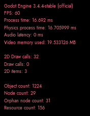

# Debug nodes

## SxDebugInfo
*Source*: [SxDebugInfo.gd](../../nodes/debug/SxDebugInfo/SxDebugInfo.gd)  
A debug panel showing performance info, shown with the F12 key.  
When shown, you can reload the current scene with F5 and pause the game with F2.  

